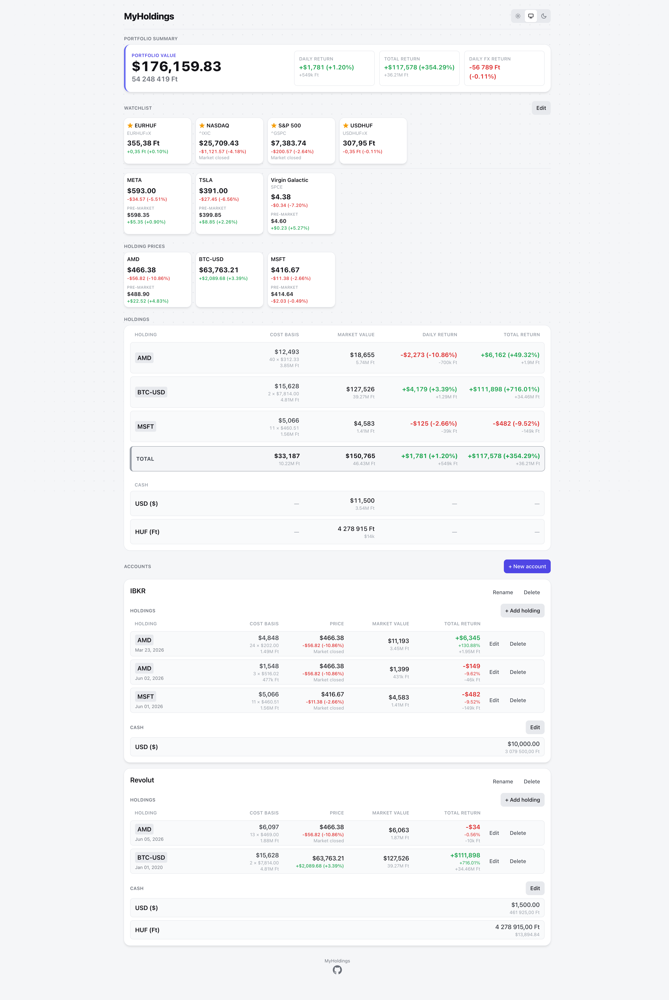
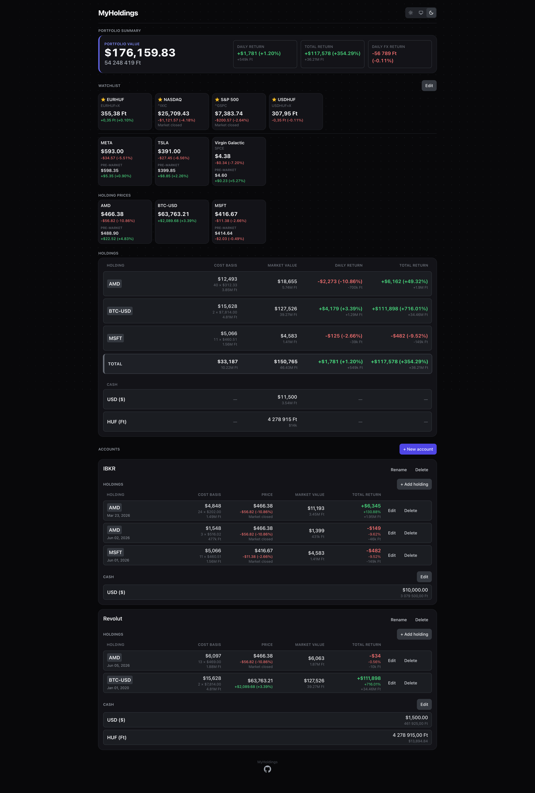
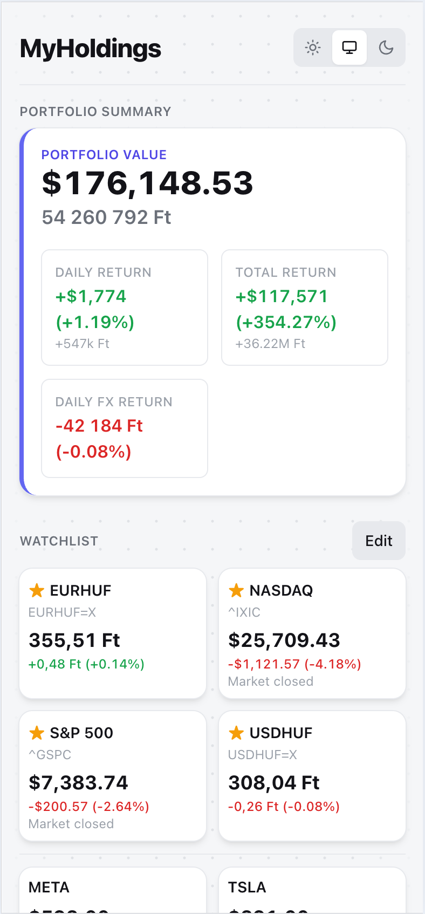
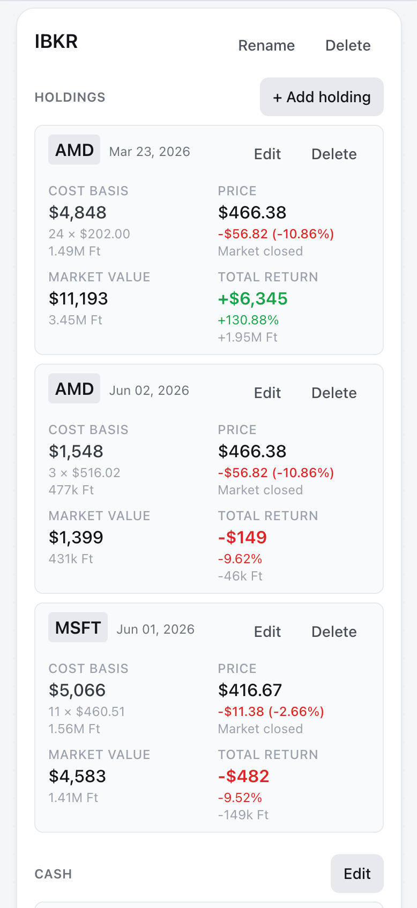
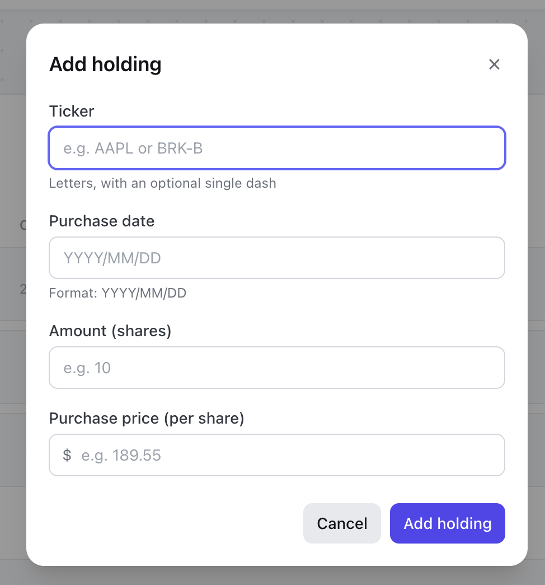
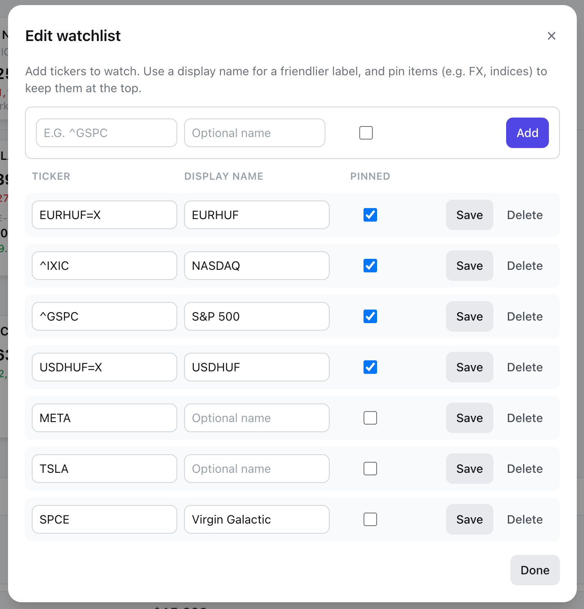
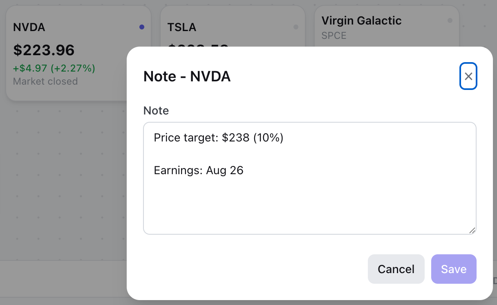
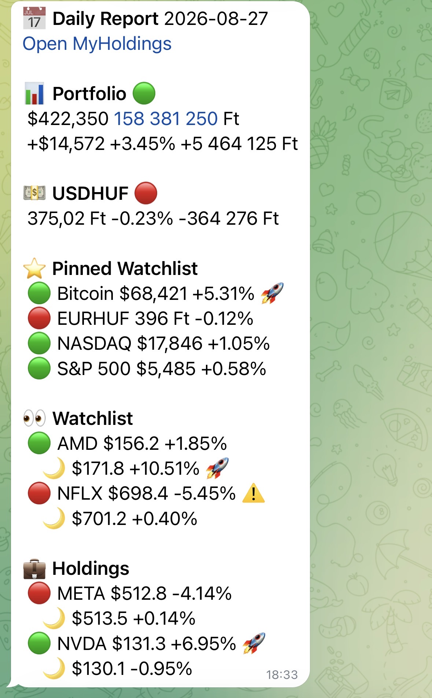

# MyHoldings

A simple, single-user web app to track your current stock portfolio.
It stores accounts, cash balances, and stock holdings (positions).
You can add stocks to your watchlist and notes to stocks.
Portfolio value is automatically saved and a Telegram daily summary (portfolio performance, watchlist, holdings) is sent every weekday after US market close (4:20 PM ET).
No login, no account/transaction history, just your current holdings.

NOTE: Account holdings (stocks) only work properly if the holding you add has USD ($) currency.

## Stack

- **web** - React + Vite + TypeScript + Tailwind CSS
- **api** - Node.js + Fastify + TypeScript (live quotes via `yahoo-finance2`)
- **db** - SQLite via Drizzle ORM (`better-sqlite3`)

## Local development

Prerequisites:

- Node 24 (`nvm use`)
- npm 10+

Install dependencies and migrate the DB:

```bash
nvm use            # selects Node 24 from .nvmrc
npm install        # installs all workspaces
npm run db:migrate # creates / migrates the local SQLite db
```

Start the app:

```bash
SECONDARY_CURRENCY="HUF,Ft,hu-HU" \
TELEGRAM_BOT_TOKEN="xxx" \
TELEGRAM_CHAT_ID="yyy" \
TELEGRAM_OPEN_MY_HOLDINGS_URL="https://portfolio.example.com/" \
npm run dev
```

Starts api (http://localhost:3000) and web (http://localhost:5173) with HUF (Ft) as a secondary currency.

## Docker

Build image locally via compose and start it:

```bash
docker compose up --build -d
```

Open the app on http://localhost:9999

### Docker compose pulling pre-built docker image

```yaml
name: my-holdings

services:
  my-holdings:
    image: ghcr.io/anubisss/my-holdings:latest
    container_name: my-holdings
    restart: unless-stopped

    environment:
      - SECONDARY_CURRENCY=HUF,Ft,hu-HU
      - TELEGRAM_BOT_TOKEN=xxx
      - TELEGRAM_CHAT_ID=yyy
      - TELEGRAM_OPEN_MY_HOLDINGS_URL=https://portfolio.example.com/

    volumes:
      - ./apps/api/data:/app/data

    ports:
      - 9999:8080
```

## License

The MIT License (MIT)

## Screenshots

Full page screenshots, light and dark theme

<a href=".github/readme_assets/full-light.png"></a>
<a href=".github/readme_assets/full-dark.png"></a>

Mobile screenshots

<a href=".github/readme_assets/mobile-01.png"></a>
<a href=".github/readme_assets/mobile-02.png"></a>

Modals

<a href=".github/readme_assets/accounts-add-holding.png"></a>
<a href=".github/readme_assets/watchlist-edit.png"></a>
<a href=".github/readme_assets/notes-edit.png"></a>

Telegram daily notification

<a href=".github/readme_assets/telegram-notification.png"></a>

## Demo video

https://www.youtube.com/watch?v=K7bcUhHu9ug
